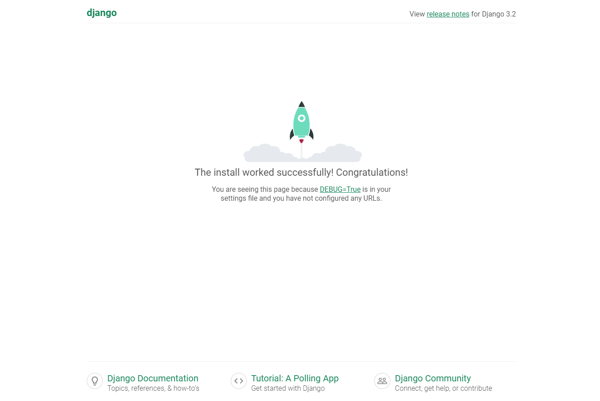

# Django

- Django(장고)란?
    - Python 기반의 대표적인 웹 프레임워크
        
        > 1. **웹 브라우저(클라이언트)**에 URL을 입력하면 실행 중인 웹 서버 시스템에 **요청(Request)**을 전송한다.
        2. **서버(Server)**는 데이터베이스를 사용하여 요청을 처리하고 **응답(Response)**으로 클라이언트에 정보를 다시 전송한다.
        3. 웹 브라우저는 전달받은 정보를 사람이 볼 수 있도록 해석하여 표시한다.
        > 
    - Django는 이 요청 및 응답 시스템에 대한 코드를 관리하는 도구

- Django 프로젝트 생성 루틴
    1. 가상환경 생성
        
        > **python -m venv venv(가상환경 이름)**
        > 
        
        가상 환경을 사용하는 이유
        1. 라이브러리 및 패키지를 프로젝트마다 독립적으로 사용하기 위해서
        2. 모든 팀원이 동일한 환경과 의존성 위에서 작업하여 버전 간 충돌을 방지하기 위해서
        
        * 가상환경 설정명은 임의로 변경이 가능하나 ‘venv’ 를 사용하는 것이 좋다.
        
    2. 가상환경 활성화
        
        > **source venv(가상환경 이름)/Scripts/activate**
        > 
        
        > **ctrl + shift + p / interpreter 검색 후 생성한 가상환경 클릭 — VS Code**
        > 
        
    3. Django 설치
        
        > **pip install django==3.2.18**
        > 
        
        Django 버전을 따로 명시하지 않을 경우 가장 최신 버전이 설치된다.
        단, 장기간 지원되는 안정적인 버전 LTS(Long-Term Support) 버전을 사용하는 것이 좋다.
        현재는 3.2 버전이 LTS 버전이다. (참고: [https://www.djangoproject.com/download/](https://www.djangoproject.com/download/))
        
        **pip list**
        해당 명령어를 통해 가상환경에 설치된 패키지 목록을 볼 수 있다. ****
        
    4. 의존성 파일 생성(패키지 설치 시마다 진행)
        
        > **pip freeze > requirements(파일명).txt**
        > 
        
        현재 가상환경에 설치되어 있는 패키지의 리스트를 requirements 문서 파일에 저장해준다.
        
        * 문서 파일의 이름은 임의로 변경이 가능하나 ‘requirements’를 사용하는 것이 좋다.
        
        **pip install -r requirements.txt**
        협업 시 해당 명령어를 통해 다른 팀원과 동일한 버전의 패키지를 설치하여 작업할 수 있다.
        
    5. git 관련 설정 시
        
        5-1. .gitignore 파일 생성
        
        첫 add 전에 .gitignore 파일을 생성하여 원격저장소에 추가하지 말아야 할 파일을 관리한다.
        
        * gitignore.io 사이트 활용([https://www.toptal.com/developers/gitignore/](https://www.toptal.com/developers/gitignore/))
        
        5-2. git 저장소 생성
        
    6. Django 프로젝트 생성
        
        > **django-admin startproject <프로젝트명> .**
        > 
        
        명령어 맨 끝에 **.**(온점)을 찍어야 현재 위치에서 프로젝트가 생성된다.
        
    7. Django 서버 실행
        
        > **python manage.py runserver**
        > 
        
        서버 실행 후에는 http://127.0.0.1:8000 에 접속해 제대로 작동하는지 확인한다
        
        
        
    8. 생성한 프로젝트 내에 앱 생성
        
        > **python manage.py startapp <앱 이름>**
        > 
        
        Django application : 독립적으로 작동하는 기능 단위 모듈로 프로젝트의 구성요소이다.
        
        * 앱의 이름은 복수형으로 지정하는 것을 권장한다.
        
    9. 앱 등록
        
        ```python
        # settings.py
        
        INSTALLED_APPS = [
        		# local app
        		**'articles',**
        
        		# 기본 django app
        		'django.contrib.admin',
        		'django.contrib.auth',
        		'django.contrib.contenttypes',
        		'django.contrib.sessions',
        		'django.contrib.messages',
        		'django.contrib.staticfiles',
        ]
        ```
        
        위의 예시는 articles라는 앱을 생성한 후 등록한 것이다.
        project 폴더 내의 settings.py 파일에 생성한 앱의 이름을 등록한다.
        
        *** 반드시 앱을 생성한 후에 등록해야 하며, 반대로 등록 후 생성은 불가능하다.**
        
    10. 데이터 흐름에 따른 코드 작성
        1. 클라이언트로부터 특정 페이지를 요청 받는다.
        
        
        
        1. 프로젝트 폴더 내의 urls.py 파일은 받은 요청을 토대로 앱 내의 views 모듈에 정의된 특정 뷰 함수를 호출한다.
        
        ```python
        # urls.py
        
        from django.contrib import admin
        from django.urls import path
        **from articles import views**
        
        urlpatterns = [
        		path('admin/', admin.site.urls),
        		**path('articles/', views.index)**
        ]
        ```
        
        1. views 모듈에는 특정 경로에 있는 template과 request 객체를 결합해 응답 객체를 반환하는 특정 뷰 함수가 정의되어 있다.
        
        * template 경로는 문자열로 작성한다.
        * templates 폴더까지만 기본 경로로 인식하기 때문에 templates 폴더 내에 또 다른 폴더를 만들 경우 폴더명까지 포함하여 경로를 작성한다.
        
        ```python
        # views.py
        
        from django.shortcuts import render
        
        # Create your views here.
        # 특정 기능을 수행하는 view 함수들을 작성
        # 모든 view 함수는 첫번째 인자로 요청 객체를 필수적으로 받는다.
        **def index(request):
        		return render(request, 'index.html')**
        ```
        
        1. 앱 내에 templates 폴더를 생성하고 그 안에 템플릿 페이지 작성
        
        * templates 폴더는 자동으로 생성되지 않기 때문에 개발자가 **직접 생성**해야 한다.
        *** 폴더명은 반드시 templates 로 한다.**

- Django MTV 디자인 패턴
    
    애플리케이션을 구조화하는 대표적인 패턴은 MVC 디자인 패턴이다.
    역할에 따라 Model, View, Controller 세 가지로 구분하는 패턴으로, 이에 대응하는 것이 Django의 MTV 디자인 패턴이다. 
    
    - Model
        - 데이터와 관련된 로직을 관리한다.
        - 응용 프로그램의 데이터 구조를 정의하고 데이터베이스의 기록을 관리한다.
        - MVC 패턴의 Model(모델)에 대응한다.
    - Template
        - 요청에 대한 결과를 화면에 보여주는 역할을 한다.
        - 유저와 어플리케이션 간의 인터페이스
        - MVC 패턴의 View(뷰)에 대응한다.
    - View
        - 요청(Request)에 따라 적절한 로직을 수행하여 응답을 반환한다.
        - MVC 패턴의 Controller(컨트롤러)에 대응한다.

- Django Template
    - DTL(Django Template Language)을 활용해 변수, 조건, 반복, 필터 등을 HTML 문서에서 실행할 수 있다.
        - Variables
            - view 함수에서 render 함수의 세 번째 인자로 딕셔너리 타입을 받을 수 있다.
            - 딕셔너리 key에 해당하는 문자열을 template에서 변수명으로 사용할 수 있다.
            
            **{{ variable }}**
            
        - Filters
            - 필터를 사용하여 변수를 수정할 수 있다.
            - Django에서는 60여 개의 built-in template filters를 제공한다. [참고자료 (Django 공식문서)](https://docs.djangoproject.com/ko/3.2/ref/templates/builtins/#ref-templates-builtins-filters)
            
             **{{ variable | filter }}**
            
            예시: {{ value | length }} → 변수(문자열 또는 리스트 형태)의 길이를 반환한다.
            
        - Tags
            - 태그를 통해 반복문 또는 조건문을 처리할 수 있다.
            - 일부 태그는 시작 태그와 종료 태그가 필요하다.
            - Django에서는 약 24개의 built-in template tags를 제공한다. [참고자료 (Django 공식문서)](https://docs.djangoproject.com/ko/3.2/ref/templates/builtins/#ref-templates-builtins-tags)
            
            예시:
            ****
                <p>입력한 이름이 없습니다.</p>
            ****
                <p>안녕하세요, {{ name }}님!</p>
            ****
            
    - 템플릿 상속
        - 웹 페이지의 일관성을 유지하고 코드 재사용성을 높이기 위해 기본 skeleton 템플릿을 작성하여 다른 템플릿에 상속할 수 있다.
        - 페이지의 공통요소를 포함하고 하위 템플릿이 재정의할 수 있는 공간을 정의한다.
        
        ```html
        <!-- 부모 템플릿 -->
        <!-- articles/base.html -->
        
        <!DOCTYPE html>
        <html lang="en">
        <head>
          <meta charset="UTF-8">
          <meta http-equiv="X-UA-Compatible" content="IE=edge">
          <meta name="viewport" content="width=device-width, initial-scale=1.0">
          <title>Document</title>
        </head>
        <body>
          
          
        </body>
        </html>
        ```
        
        ```html
        <!-- 자식 템플릿 -->
        <!-- articles/greeting.html -->
        
        
        
        
        	<h3>Hello, Rilee!</h3>
        
        ```
        
        - 부모 템플릿에 기본적인 html 구조가 갖춰져 있기 때문에 부모 템플릿의 block 영역만 자식 템플릿에 작성하여 사용하는 것이 가능하다.
        - 추가 템플릿 경로 지정
            - 앱 내의 settings.py  파일 TEMPLATES의 DIRS라는 리스트에 디렉터리를 추가 설정할 수 있다.
            - 이 때, 경로를 최상단 지점 BASE_DIR로 설정하면 편하다.
            
            TEMPLATES = [
                {
                    …
                    **‘DIRS’ : [BASE_DIR / ‘templates’,],**
                    …
                }
            ]
            
    - 요청과 응답
        - form 태그
            - form 태그는 사용자로부터 입력받은 데이터를 서버로 전송하는 태그이다.
            - 핵심 속성
                - action
                    - 데이터를 어디로  보낼 것인가
                    - 입력 데이터가 전송될 URL을 지정한다.
                - method
                    - 어떤 방식으로 보낼 것인가
                    - 데이터의 HTTP request methods(GET, POST)를 지정한다.
                        - GET : 정보를 요청하기 위한 메서드로 URL 주소 끝에 파라미터로 전송된다.
                        - POST : 리소스를 생성하고 변경하기 위해 데이터를 보낼 때 사용하는 메서드로 데이터를 HTTP 메시지 body 안에 담아서 서버로 보낸다.
        - input 태그
            - input 태그는 사용자로부터 데이터를 입력받을 수 있는 태그이다.
            - 핵심 속성
                - name
                    - 사용자가 입력한 데이터에 이름을 붙이는 것으로 name에 정의된 값이 key, 사용자가 입력한 데이터 내용이 value가 된다.
                    - 입력받은 정보를 추출할 때에는 데이터의 name, 즉 key 값으로 데이터 내용에 접근할 수 있다.
            
            ```html
            <!-- articles/throw.html -->
            
            <form action="/catch/" method="GET">
            	<input type="text" name="message">
            	<input type="submit">
            </form>
            ```
            
            ```python
            # views.py
            
            def catch(request):
            		message = request.GET.get('message')
            		context = {
            				'message': message,
            		}
            		return render(request, 'articles/catch.html', context)
            ```
            
            ```html
            <!-- articles/catch.html -->
            
            <h3>{{ message }}</h3>
            ```
            
            throw 페이지에서 입력한 데이터를 catch 사이트에서 받아 그대로 출력해 보여주는 예시이다.
            

- Django URLs
    - 변수와 URL
        - URL의 일부만 다르고 중복되는 템플릿이 많을 때에는 URL에 변수를 포함시킬 수 있다.
        
        **<path_converter(URL 변수 타입) : variable_name>** [참고자료 (Django 공식문서)](https://docs.djangoproject.com/ko/3.2/topics/http/urls/#path-converters)
        
        ```python
        urlpatterns = [
        		path('articles/1/', ...),
        		path('articles/2/', ...),
        		path('articles/3/', ...),
        		path('articles/4/', ...),
        		path('articles/5/', ...),
        ]
        
        # URL 주소에서 articles 뒤의 번호만 바뀌고 있다.
        ```
        
        ```python
        urlpatterns = [
        		**path('articles/<int:num>/', ...),**
        ]
        
        # URL 주소에 변수를 포함해 숫자를 받고 있기 때문에 중복된 템플릿 주소를 입력할 필요가 없다.
        ```
        
    - App의 URL
        - 여러 개의 앱을 생성한 후에는 한 곳에서 모든 URL을 관리하는 것이 불편할 수 있다.
        - 이를 해결하기 위해서 각각의 앱 내에 urls.py 파일을 따로 만들어 각자 관리한다.
        기존 프로젝트 폴더 내의 urls.py 파일에는 include 함수를 입력해 앱 내의 urls.py 파일을 참조할 수 있도록 한다.
        
        ```python
         # firstpjt/urls.py
        
        from django.urls import path, **include**
        
        urlpatterns = [
        		path('admin/', admin.site.urls),
        		**path('articles/', include('articles.urls')),**
        		**path('pages/', include('pages.urls')),**
        ]
        
        # firstpjt 라는 프로젝트 폴더 내의 urls.py 파일은 각 앱의 urls.py 파일을 참조한다.
        ```
        
        ```python
         # articles/urls.py
        
        from django.urls import path
        **from . import views**
        
        urlpatterns = [
        		path('index/', views.index),
        		path('throw/', views.throw),
        		path('catch/', views.catch),
        ]
        ```
        
        ```python
         # pages/urls.py
        
        from django.urls import path
        **from . import views**
        
        urlpatterns = [
        		path('index/', views.index),
        ]
        ```
        
    - URL 이름 지정
        - 단, URL을 각자 앱에서 관리할 경우 URL 주소가 변경된다. 기존의 주소를 사용했던 모든 위치를 찾아 변경해야 하는 번거로운 일이 생긴다.
        - 이를 해결하기 위해 URL에 이름을 지정하고 그 이름을 대신 사용할 수 있다.
        - url 태그 : 주어진 URL 패턴의 이름과 일치하는 절대 경로 주소를 반환한다.
        
        ****
        
        ```python
        # articles/urls.py
        
        from django.urls import path
        from . import views
        
        urlpatterns = [
        		**path('index/', views.index, name='index'),
        		path('throw/', views.throw, name='throw'),
        		path('catch/', views.catch, name='catch'),**
        ]
        ```
        
        ```html
        <!-- articles.index.html -->
        
        
        
        
        	<h1>Hello, {{ name }}</h1>
        	**<a href=''>throw</a>**
        
        ```
        
    - URL Namespace
        - URL 이름을 지정하더라도 각 앱에 똑같은 URL 이름이 사용될 수도 있다. 이 경우 단순히 이름만으로는 구분하기가 어렵다.
        - 이럴 때에는 app_name 속성을 지정한다.
        - urls.py 파일에는 **app_name=’앱 이름’**을 입력하고 URL 태그에는 **** 형태로 입력한다.
        - **app_name을 지정한 후에는 url 태그에서 반드시  형태로만 입력해야 한다.**
        
        ```python
        # articles/urls.py
        
        from django.urls import path
        from . import views
        **app_name = 'articles'**
        
        urlpatterns = [
        	...
        ]
        ```
        
        ```html
        ****
        ```
        

- Django Model
    - DB의 데이터 구조를 정의하고 데이터를 조작할 수 있는 기능을 제공한다.
    - Model 클래스 만들기
        
        ```python
        # articles/models.py
        
        class Article(models.Model):
        		**title** = models.**CharField(max_length=10)**
        		**content** = models.**TextField()**
        		# **클래스 변수명** = models.**model Field 클래스(model Field 클래스의 키워드 인자)**
        ```
        
        1. **클래스 변수명** : 테이블의 각 필드 이름
        2. **model Field 클래스** : 테이블 필드의 데이터 타입
        3. **model Field 클래스의 키워드 인자** : 테이블 필드의 제약 조건 설정
        
        [참고자료 (Django 공식문)](https://docs.djangoproject.com/en/4.1/ref/models/fields/)
        
        기본적인 **model Field 클래스**
        
        1. CharField() : 길이 제한이 있는 문자열(최대 길이를 설정하는 max_lenth가 필수 인자이다.)
        2. TextField() : 길이 제한이 없는 문자열
        3. DateTimeField() : 날짜와 시간을 넣을 때 사용하는 클래스
            - DateTimeField의 선택인자
            - auto_now : 데이터를 저장할 때마다 자동으로 현재 날짜와 시간을 저장한다.
            - auto_now_add : 데이터가 처음 생성될 때에만 자동으로 현재 날짜와 시간을 저장한다.
        
    - Migrations
        - 모델 클래스의 변경 사항(필드 생성, 추가, 수정 등)을 DB에 최종으로 반영하는 방법이다.
        
        **$ python manage.py makemigrations**
        
        모델 클래스를 기반으로 설계도(migration)를 작성하는 명령어이다.
        마이그레이션 파일이 생성된다.
        
        **$ python manage.py migrate**
        
        마이그레이션을 DB에 전달하여 반영하도록 하는 명령어이다.
        
        **$ python manage.py showmigrations**
        
        프로젝트의 마이그레이션에 대해 적용 여부를 보여주는 명령어이다.
        마이그레이션 파일들이 migrate 됐는지 확인하는 용도로, [X] 표시는 적용된 마이그레이션을 의미한다. 
        
    - Admin site
        - Django는 추가 설치 및 설정 없이 관리자 인터페이스를 제공한다.
        - 관리자 계정 등록하기
            
            **$ python manage.py createsuperuser**
            
            admin 계정을 생성하는 명령어이다.
            
        - 관리자 계정을 생성한 후에는 앱 내의 admin.py 파일에 모델 클래스를 등록한다. 모델 클래스를 등록하지 않으면 admin site에서는 확인할 수 없다.
            
            ```python
            # articles/admin.py
            
            from django.contrib import admin
            from .models import Article
            
            **admin.site.register(Article)**
            ```
            
    - 데이터베이스 초기화 방법
        1. migration 파일을 삭제한다.
        2. db.sqlite3 파일을 삭제한다. *** migrations 폴더는 지워서는 안 된다.**

- Django ORM
    - 객체와 관계형 데이터베이스를 연결해주는 것으로, 객체 지향 프로그래밍 언어를 사용해 호환되지 않는 시스템 간에 데이터를 변환하는 프로그래밍 기술이다.
    - 즉, 파이썬으로 작성한 코드가 ORM에 의해 SQL로 변환되어 데이터베이스로 전달되고, 데이터베이스의 응답 데이터를 ORM이 QuerySet이라는 자료 형태로 변환하여 우리가 전달하는 것이다.
        
        > QuerySet : 데이터베이스로부터 전달받은 데이터 모음
        * 단일 객체일 경우 QuerySet이 아닌 인스턴스를 반환한다.
        > 
    - QuerySet API : ORM에서 데이터를 검색, 필터링, 정렬 및 그룹화 등 조작하는데 사용하는 도구
        
        QuerySet API 구문
        
        **Model class.objects.QuerySet API**
        
        [참고자료 (Django 공식문서)](https://docs.djangoproject.com/en/3.2/ref/models/querysets/)
        
    - Django Shell : django 환경 안에서 실행되는 파이썬 쉘이다. 일반 파이썬 쉘을 통해서는 django 프로젝트 환경에 접근이 불가하므로 django 쉘을 사용한다. 쉘에 QuerySet API 구문을 입력해 데이터를 조작할 수 있다.
        
        **$ pip install ipython
        $ pip install django-extensions**
        
        ```python
        # settings.py
        
        INSTALLED_APPS = [
        		'articles',
        		**'django_extensions',**
        		...,
        ]
        ```
        
        $ **python manage.py shell_plus**
        
        패키지 설치 후 django_extensions 앱을 settings.py 파일에 등록한다.
        터미널에 python manage.py shell_plus 명령어를 입력에 shell에 진입한다.
        
        * shell_plus는 필요한 모델을 자동으로 import 해주기 때문에 편리하다.
        

- Django ORM CRUD
    - Create
        - 데이터 객체 생성 방법
            1. 첫 번째 방법
                
                ```python
                # 특정 테이블에 새로운 행을 추가하여 데이터 추가
                
                article = Article()
                # Article(class)로부터 article(instance) 만들기
                
                article.title = 'first'
                # 인스턴스 변수(title)에 값 할당
                
                article.content = 'django!'
                # 인스턴스 변수(content)에 값 할당
                
                **article.save()
                # save 메서드를 호출해야 DB에 데이터가 저장된다.**
                ```
                
            2. 두 번째 방법
                
                ```python
                article = Article(title='second', content='django!')
                # Article(class)의 변수 값을 모두 입력하여 article(인스턴스) 만들기
                
                **article.save()
                # save 메서드를 호출해야 DB에 데이터가 저장된다.**
                ```
                
            3. 세 번째 방법
                
                ```python
                # QuerySet API 중 create() 메서드 활용하기
                
                Article.objects.create(title='third', content='django!')
                # 별도의 save 메서드를 호출하지 않아도 자동으로 DB에 데이터가 저장된다.
                ```
                
    - Read
        - all() 메서드: 전체 데이터 조회
            
            **Article.objects.all()**
            
            테이블의 모든 데이터를 조회한다.
            
        - get() 메서드: 단일 데이터 조회
            
            **Article.objects.get(content=’django!’)**
            
            조건에 해당하는 하나의 객체를 반환한다. 찾고자 하는 객체가 없거나 둘 이상의 객체를 찾으면 오류가 발생한다.
            
        - filter() 메서드: 특정 조건 데이터 조회
            
            **Article.objects.filter(title=’first’)**
            
            조건에 해당하는 모든 객체, 즉 QuerySet을 반환한다.
            
        
    - Update
        - 수정할 인스턴스를 조회한 후 변경하고자 하는 인스턴스 변수에 새로운 값을 설정해준다. 그 후 저장한다.
        
        ```python
        # 수정할 인스턴스를 조회한다.
        article = Article.objects.get(pk=1)
        
        # 인스턴스 변수를 변경한다.
        article.title = 'byebye'
        
        # 저장한다.
        article.save()
        ```
        
    
    - Delete
        - 삭제할 인스턴스를 조회한 후 delete 메서드를 통해 데이터를 삭제한다.
        
        ```python
        # 삭제할 인스턴스를 조회한다.
        article = Article.objects.get(pk=1)
        
        # delete 메서드를 호출한다.
        article.delete()
        ```
        

- Django Form
    - HTML Form 요소를 통해 사용자로부터 데이터를 받을 수는 있으나 그 데이터에 대한 유효성을 검증하기는 어렵다.
    - Django Form을 활용하면 사용자가 입력한 데이터를 수집하고 수집한 데이터가 정확하고 유효한지 검증할 수 있다.
        - Form(일반 폼)
            - 직접 필드를 정의하고 위젯 설정이 필요하다.
                
                > 위젯(Widget): HTML input 요소에 대한 표현을 담당한다.
                > 
            - 사용자 입력 데이터를 DB에 저장하지 않을 때 활용한다. (예: 로그인)
            
            ```python
            # articles/forms.py
            
            from django import forms
            
            class ArticleForm(forms.Form):
            		title = forms.CharField(max_length=10)
            		content = forms.CharField(widget=forms.Textarea)
            ```
            
        - Model Form(모델 폼)
            - 모델과 필드를 지정하면 모델 폼이 자동으로 폼 필드를 생성한다.
            - model 클래스의 내역 그대로 form을 만든다면 forms.py 파일에서 form필드를 중복해서 정의할 필요가 없다.
            - 사용자 입력 데이터를 DB에 저장해야 할 때 활용한다. (예: 회원가입)
            
            ```python
            # articles/forms.py
            
            from django import forms
            from .models import Article
            
            class ArticleForm(forms.ModelForm):
            		**class Meta:**
            				model = Article
            				**fields = '__all__'**
            ```
            
            - ModelForm의 정보는 Meta class에 작성한다. 특정 필드만 지정하거나 exclude 속성을 사용해 모델에서 일부 필드만 화면에 출력되도록 할 수 있다.
            
            - ModelForm을 적용한 Create 로직
            
            ```python
            # articles.views.py
            
            from django.shortcuts import render, redirect
            from .models import Article
            from .forms import ArticleForm
            
            def create(request):
            		if request.method == 'POST':
            				form = ArticleForm(request.POST)
            				if form.is_valid():
            						article = form.save()
            						return redirect('articles:detail', article:pk)
            
            		else:
            				form = ArticleForm()
            		context: {
            				'form': form,
            		}
            		return render(request, 'articles/create.html', context)
            ```
            
            - ModelForm을 적용한 Update 로직
            
            ```python
            # articles.views.py
            
            from django.shortcuts import render, redirect
            from .models import Article
            from .forms import ArticleForm
            
            def update(request, article_pk):
            		article = Article.objects.get(pk=article_pk)
            		if request.method == 'POST':
            				form = ArticleForm(request.POST, instance=article)
            				if form.is_valid():
            						form.save()
            						return redirect('articles:detail', article:pk)
            
            		else:
            				form = ArticleForm(instance=article)
            		context: {
            				'article': article,
            				'form': form,
            		}
            		return render(request, 'articles/update.html', context)
            ```
            
            > **HTTP Request Methods**
            1. **GET** : 서버에 특정 리소스의 정보를 요청하기 위한 메서드(CRUD의 R)
            2. **POST** : 리소스를 생성하거나 변경하기 위해 서버에 데이터를 보낼 때 사용하는 메서드(CRUD의 CUD)
            > 
            

- Django Authentication System
    - Django에서 제공하는 기본 인증 시스템으로, 사용자 인증(사용자 신원 확인)과 권한 부여 기능을 제공하고 처리한다.
    - Custom User model 만들기
        - Django가 기본적으로 제공하는 User model은 별도의 설정 없이 사용할 수 있어 간편하지만 직접 수정할 수는 없기 때문에 따로 User model을 만들어 사용하는 것을 권장한다.
        1. AbstractUser를 상속받아 User model을 만든다.
        2. 단, AbstractUser를 사용하여 모델을 설정할 경우 settings.py에 추가 설정을 해주어야 한다.
        3. 또한 기본 User 모델이 아니기 떄문에 admin에 User 모델을 등록해야 한다.
        
        [참고자료(Django 공식문서)](https://docs.djangoproject.com/en/3.2/topics/auth/customizing/#substituting-a-custom-user-model)
        
        ```python
        # accounts/models.py
        
        from django.contrib.auth.models import AbstractUser
        
        class User(AbstractUser):
        		pass
        ```
        
        ```python
        # settings.py
        
        AUTH_USER_MODEL = 'myapp(앱 이름).MyUser(모델명)'
        
        **# 프로젝트 중간에는 AUTH_USER_MODEL을 변경할 수 없다.
        # 따라서 User model 대체 작업은 첫 migrate 실행 전에 마쳐야 한다.
        # 이미 진행한 경우 데이터베이스 초기화 후 변경한다.**
        ```
        
        ```python
        # accounts/admin.py
        
        from django.contrib import admin
        from django.contrib.auth.admin import UserAdmin
        from .models import User
        
        admin.site.register(User, UserAdmin)
        ```
        

- Django Authentication System - 로그인/로그아웃 등 구현 코드
    
    > **HTTP(HyperText Transfer Protocol) 특징**
    1. 비연결성(Connectionless) : 서버는 요청에 대한 응답을 보낸 후 연결(접속)을 끊는다.
    2. 비상태성(Stateless) : 연결이 끊어지면 클라이언트와 서버 간의 통신이 끝나며 상태를 저장하지 않는다.
    > 
    
    > **쿠키(Cookie)**
    - 서버가 사용자의 웹 브라우저에 전송하는 작은 데이터 파일이다.
    **-** 클라이언트의 로컬에 Key-Value 데이터 형식으로 저장된다.
    - 세션을 유지하는 방식 중 가장 대표적인 방식이다.
    
    **세션(Session)**
    - 서버에 생성되며 클라이언트와 서버 간의 상태를 유지한다.
    - 상태 정보를 저장하는 데이터 저장 방식이다.
    
    * 클라이언트가 서버에 접속하면 서버가 session id를 발급하여 클라이언트에게 응답해준다. 클라이언트는 응답 받은 session id를 쿠키(클라이언트 로컬)에 저장한다. 클라이언트가 다시 동일한 서버에 접속할 때 session id가 저장된 쿠키를 서버에 전달하면 서버는 session id를 확인하여 인증 상태를 유지한다.
    > 
    - Login
        - 세션(Session)을 create하는 로직과 같다.
        - Django가 제공하는 built-in form 중 하나인 AuthenticationForm을 사용한다.
        
        ```python
        # accounts/views.py
        
        from django.contrib.auth.forms import AuthenticationForm
        from django.contrib.auth import login as auth_login
        
        def login(request):
        		**if request.user.is_authenticated:**
                return redirect('articles:index')
        
        		if request.method == 'POST':
        				form = AuthenticationForm(request, request.POST)
        				if form.is_valid():
        						auth_login(request, form.get_user())
        						return redirect('articles:index')
        		else:
        				form = AuthenticationForm()
        		context = {
        				'form': form,
        		}
        		return render(request, 'accounts/login.html', context)
        ```
        
        **is_authenticated 속성**
        
        - User model의 속성이다.
        - 사용자가 인증되었는지 확인하는 방법 중 하나이다.
        - 위 로그인 코드에서는 사용자가 인증했다면, 즉 이미 로그인한 사용자라면 index 페이지로 이동하도록 했다.
        
    - Logout
        - 세션(Session)을 delete하는 로직과 같다.
        
        ```python
        # accounts/views.py
        
        **from django.contrib.auth.decorators import login_required**
        from django.contrib.auth import logout as auth_logout
        
        **@login_required**
        def logout(request):
        		auth_logout(request)
        		return redirect('articles:index')
        ```
        
        **login_required 데코레이터**
        
        - 인증된 사용자에 대해서만 view 함수가 실행되도록 하는 데코레이터이다.
        - 로그인을 하지 않은 사용자가 로그인을 전제로 하는 로그아웃, 회원정보 수정, 회원탈퇴, 비밀번호 변경을 하려고 하면 자동으로 로그인 페이지로 이동하도록 한다.
        
    - 회원가입 / 회원정보 수정
        - User 객체를 Create / Update 하는 것이다.
        - Django가 제공하는 built-in form 중 하나인 UserCreationForm, UserChangeForm을 사용한다.
        - **단, UserCreationForm, UserChangeForm은 기존 유저 모델을 기반으로 작성된 클래스이기 때문에 에러가 발생한다. 따라서 현재 프로젝트에서 활성화된 사용자 모델인 Custom User model을 참조할 수 있도록 명시한다.**
        - UserChangeForm을 사용하면 회원정보 수정 시, 일반 사용자에게까지 너무 많은 필드(사용자 권한, 스태프 권한 등)가 노출된다. 따라서 일반 사용자가 수정할 수 있는 필드만 커스텀하여 보여줄 수 있도록 한다.
        
        ```python
        # accounts/forms.py
        
        from django.contrib.auth import get_user_model
        from django.contrib.auth.forms import UseCreationForm, UserChangeForm
        
        class CustomUserCreationForm(UserCreationForm):
        		class Meta(UserCreationForm.Meta):
        				**model = get_user_model()**
        
        class CustomUserChangeForm(UserChangeForm):
        		class Meta:
        				**model = get_user_model()**
        				fields = ('email', 'first_name', 'last_name')
        ```
        
        **get_user_model() : 현재 프로젝트에서 활성화된 사용자 모델을 반환하는 함수이다.**
        
        ```python
        # accounts/views.py
        
        from .forms import CustomUserCreationForm, CustomUserChangeForm
        from django.contrib.auth import login as auth_login
        from django.contrib.auth.decorators import login_required
        
        def signup(request):
        		if request.user.is_authenticated:
                return redirect('articles:index')
        
            if request.method == "POST":
                form = CustomUserCreationForm(request.POST)
                if form.is_valid() :
                    user = form.save()
                    **auth_login(request, user)
        						# 회원 가입 후 자동으로 로그인까지 되도록 한다.**
                    return redirect('articles:index')
            else:
                form = CustomUserCreationForm()
            context = {
                'form' : form,
            }
            return render(request, 'accounts/signup.html', context)
        
        @login_required
        def update(request):
        		if request.method == 'POST':
                form = CustomUserChangeForm(request.POST, instance=request.user)
                if form.is_valid():
                    form.save()
                    return redirect('articles:index')
            else:
                form = CustomUserChangeForm(instance=request.user)
            context = {
                'form': form,
            }
            return render(request, 'accounts/update.html', context)
        ```
        
    - 회원 탈퇴
        - User 객체를 Delete 하는 것이다.
        
        ```python
        # accounts/views.py
        
        from django.contrib.auth import logout as auth_logout
        from django.contrib.auth.decorators import login_required
        
        @login_required
        def delete(request):
            if request.user.is_authenticated:
                request.user.delete()
                **auth_logout(request)
        				# 회원탈퇴를 하면서 사용자의 세션 정보까지 지운다.**
            return redirect('articles:index')
        ```
        
    
    - 비밀번호 변경
        - Django에서는 비밀번호 변경 기능을 회원정보 수정 페이지가 아닌 별도의 페이지에서 제공한다.
        - Django가 제공하는 built-in form 중 하나인 PasswordChangeForm을 사용한다.
        - 암호를 변경하면 세션 정보가 변경되기 때문에 로그인 정보가 사라지면 자동으로 로그아웃 된다. 하지만 편의를 위해 암호가 변경되어도 로그인 상태를 유지하려면 새로운 암호의 세션 데이터를 기존 세션 데이터로 업데이트하면 된다.
        
        ```python
        # accounts/views.py
        
        from django.contrib.auth.forms import PasswordChangeForm
        **from django.contrib.auth import update_session_auth_hash**
        from django.contrib.auth.decorators import login_required
        
        @login_required
        def change_password(request):
            if request.method == 'POST':
                form = PasswordChangeForm(request.user, request.POST)
                if form.is_valid():
                    user = form.save()
                    **update_session_auth_hash(request, user)**
                    return redirect('articles:index')
            else:
                form = PasswordChangeForm(request.user)
            context = {
                'form': form,
            }
            return render(request, 'accounts/change_password.html', context)
        ```
        
        **update_session_auth_hash(request, user)** : 암호 변경 시 세션 무효화를 방지한다.
        
    

- Django Static Files
    - Static Files: 변경되지 않고 고정적으로 제공되는 서버의 파일, 즉 개발 리소스의 정적인 파일이다.
    - static 파일 경로
        - 기본 경로: app/static
        - 추가 경로: STATICFILES_DIRS 설정
        
        ```python
        # settings.py
        
        # 기본 경로
        **STATIC_URL = '/static/'**
        
        # 추가 경로
        **STATICFILES_DIRS = [
        		BASE_DIR / 'static',
        ]**
        ```
        
    - Media Files: 사용자가 웹에서 업로드하는 정적 파일
        - 이미지 업로드에는 ImageField라는 모델 필드를 사용한다.
            - ImageField를 사용하려면 Pillow 라이브러리를 설치해야 한다.
            - DB에는 이미지가 직접 저장되지 않고 이미지 파일의 경로 문자열이 저장된다.
            - 이미지 업로드 시 form 요소에 enctype 속성을 추가한다.
                
                ```html
                <!-- articles/create.html -->
                
                <h1>CREATE</h1>
                <form action="" method="POST" **enctype="multipart/form-data"**>
                	
                	{{ form.as_p }}
                	<input type="submit">
                </form>
                ```
                
            - 이미지 업로드 시 view 함수에는 업로드 파일에 대한 추가 코드를 작성한다.
                
                ```python
                # articles/views.py
                
                def create(request):
                		if request.method == 'POST':
                				form = ArticleForm(request.POST, **request.FILES**)
                				...
                ```
                
            - 업로드한 이미지는 url 속성을 통해 파일의 경로 값으로 불러올 수 있다.
                
                ```html
                <!-- articles/detail.html -->
                
                
                ```
                
        - media 파일 설정
            - MEDIA_ROOT: 미디어 파일이 위치하는 디렉토리의 절대 경로
            - MEDIA_URL: MEDIA_ROOT에서 제공하는 미디어 파일에 대한 주소 생성
            
            ```python
            # settings.py
            
            **MEDIA_ROOT = BASE_DIR / 'media'
            
            MEDIA_URL = '/media/'**
            ```
            
            ```python
            # crud(프로젝트)/urls.py
            
            **from django.conf import settings
            from django.conf.urls.static import static**
            
            urlpatterns = [
            		path('admin/', admin.site.urls),
            		path(...)
            ] **+ static(settings.MEDIA_URL, document_root=settings.MEDIA_ROOT)**
            ```
            
        

- Django 1 : N 관계
    - Foreign Key: 테이블의 필드 중에서 다른 테이블의 행과 식별할 수 있는 키이다.
    - **ForeignKey(to, on_delete)**
        - django에서 1:N 관계를 설정할 때 사용하는 모델 필드이다.
        - 1:N 관계에서 N측에 명시한다.
        - to: 참조하는 모델 class 이름을 적는다.
            - User 모델을 외래 키로 참조하는 경우 **settings.AUTH_USER_MODEL**을 사용한다.
        - on_delete: 외래 키가 참조하는 객체가 삭제되었을 때 연결된 하위 객체를 어떻게 처리할지 결정하는 설정이다.
            - CASCADE: 부모 객체가 삭제됐을 때 이를 참조하는 하위 객체도 함께 삭제된다.
            - [참고자료(Django 공식문서)](https://docs.djangoproject.com/en/3.2/ref/models/fields/#arguments)
    - 역참조: 나를 참조하는 테이블을 참조하는 것으로 1:N 관계에서 1이 N을 참조한다.
        
        **article.comment_set.all()
        모델 인스턴스.related manager.QuerySet API**
        
        - related manager: 1:N 또는 N:M 관계에서 역참조 시에 사용한다.
        - 1:N 관계에서 생성되는 related manager 이름은 참조하는 **“모델명_set”** 이름 규칙으로 만들어진다.
    - 코멘트 생성 구현 코드
        
        ```python
        # articles/views.py
        
        def comment_create(request, pk):
        		article = Article.objects.get(pk=pk)
        		comment_form = CommentForm(request.POST)
        		if comment_form.is_valid():
        				comment = comment_form.**save(commit=False)**
        				comment.article = article
        				comment.user = request.user
        				comment.save()
        				return redirect('articles:detail', article.pk)
        		context = {
        				'article': article,
        				'comment_form': comment_form,
        		}
        		return render(reqeust, 'articles/detail.html', context)
        ```
        

- Django M : N 관계
    - ManyToManyField: 다대다 관계 설정 시 사용하는 모델 필드로 중개 테이블을 자동으로 생성해준다.
    - **ManyToManyField(to, **options)**
        - M:N 관계를 맺는 두 모델 어디에 위치해도 상관없다. 단, 참조와 역참조 방향에 주의한다.
        - to: 참조하는 모델 class 이름을 적는다.
        - 옵션으로 사용할 수 있는 인자
            - related_name: 역참조 시 사용하는 이름을 설정할 수 있다. _set 과 동일한 기능이다.
            - through: 중개 테이블을 직접 작성할 경우 through 뒤에 중개 테이블에 해당하는 모델명을 적는다.
            - symmetrical: 동일한 모델, 즉 ‘self’를 참조할 때, 대칭 관계 설정에 사용한다.
                - 기본값은 True이다. 대칭을 원하지 않으면 False로 설정한다.
                - 대칭 관계일 경우, source 모델의 인스턴스가 target 모델의 인스턴스를 참조하면 자동으로 target 모델 인스턴스도 source 모델 인스턴스를 참조한다.
                - 예를 들면, 대칭 관계에서는 인스타그램에서 한 유저를 팔로우하면 자동으로 해당 유저도 나를 팔로우하는 맞팔 상태가 된다.
    - 팔로우 구현 코드
        
        ```python
        # accounts/models.py
        
        class User(AbstractUser):
        		followings = models.ManyToManyField('self', symmetrical=False, related_name='followers')
        ```
        
        ```python
        # accounts/views.py
        
        @login_required
        def follow(request, user_pk):
        		User = get_user_model()
        		person = User.objects.get(pk=user_pk)
        		if person != request.user:
        				if person.followers.filter(pk=request.user.pk).exists():
        						person.followers.remove(request.user)
        				else:
        						person.followers.add(request.user)
        		return redirect('articles:profile', person.username)
        ```
        
        ```html
        <!-- accounts/profile.html -->
        
        <div>
        	<div>
        		팔로잉 : {{ person.followings.all|length }} / 팔로워 : {{ person.followers.all|length}}
        	</div>
        	
        		<div>
        			<form action="" method="POST">
        				
        				
        					<input type="submit" value="Unfollow">
        				
        					<input type="submit" value="Follow">
        				
        			</form>
        		</div>
        	
        </div>
        ```
        

- Fixtures
    - fixtures: 실제 DB의 데이터를 json 형식으로 django에 삽입할 때 사용한다.
        - fixtures를 사용하여 모델의 초기 데이터를 제공할 수 있다.
    - fixtures 명령어
        - dumpdata: 데이터베이스의 모든 데이터를 추출하여 json 파일로 만드는 명령어
            
            **$ python -Xutf8 manage.py dumpdata —indent N(숫자) app_name.ModelName > filename.json**
            
            **-Xutf8** : window 환경에서 데이터에 한글이 있어 encoding codec 에러가 발생하는 것을 방지한다.
            **—indent N(숫자)** : 입력한 숫자크기의 공백을 사용하여 들여쓰기를 추가해 데이터 파일을 보기에 편하게 만들어준다. 해당 옵션이 없을 경우 한 줄에 모든 데이터가 추출되어 보기 불편하다.
            
            **app_name.ModelName** : app_name.ModelName을 여러 개 나열하면 모든 모델 데이터를 하나의 파일에 추출하는 것도 가능하지만 권장하지 않는다. 
            
        - loaddata: fixtures 데이터를 데이터베이스로 불러오는 명령어
            
            **$ python manage.py loaddata filename.json**
            
            fixtures 파일은 app 내의 fixtures 폴더 안에 있어야 로드가 가능하다.
            한꺼번에 여러 파일을 로드할 수 있으나 모델 관계에 따라 순서가 중요할 수 있다.