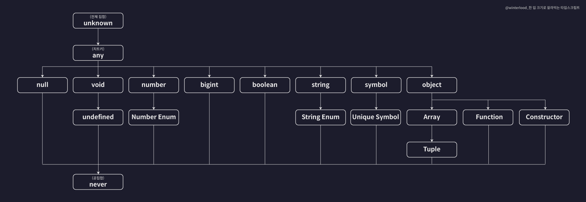

# TypeScript

- 타입스크립트란?
  - TypeScript는 JS의 구문이 허용되는, JavaScript의 *상위 집합* 언어
  - 자바스크립트에 타입(type)을 추가한 언어
  - 타입스크립트의 등장 배경
    - JavaScript는 웹 페이지에 사소한 상호작용을 추가하기 위한 작은 스크립팅 언어로 시작하여, 규모에 상관없이 프론트엔드와 백엔드 애플리케이션에서 선택 가능한 언어로 성장했다. JavaScript로 작성된 프로그램의 크기, 범위 및 복잡성은 기하급수적으로 커졌지만, 다른 코드 단위 간의 관계를 표현하는 JavaScript 언어의 능력은 그렇지 못했다.
    - 이런 JavaScript의 문제점을 극복하기 위해서 타입 시스템을 추가하여 코드의 안정성과 유지보수성을 높인 TypeScript가 등장했다.
- 기본 타입

  

  - 숫자(number)
    - 부동 소수점 값
    - 16진수, 10진수 리터럴 및 2진수, 8진수 리터럴도 지원한다.
    ```tsx
    let age: number = 25;
    let pi: number = 3.14;
    ```
  - 문자열(string)
    - 텍스트 데이터 타입
    - 큰따옴표 (`"`)나 작은따옴표 (`'`)를 문자열 데이터를 감싸는데 사용한다.
    - 백틱/백쿼트 (<code>\`</code>) 문자로 감싸지며, `${ expr }`과 같은 형태로 표현식을 포함할 수 있다.
    ```tsx
    let name: string = "John";
    let greeting: string = `Hello, ${name}`;
    ```
  - 불리언(boolean)
    - 참/거짓(true/false) 값
    ```tsx
    let isStudent: boolean = true;
    let isGraduated: boolean = false;
    ```
  - 배열(Array)
    - 동일한 타입의 요소들을 모아 놓은 데이터 구조
    ```tsx
    let list: number[] = [1, 2, 3];
    let list: Array<string> = ["Alice", "Bob", "Charlie"];
    ```
  - 튜플(tuple)
    - 요소의 타입과 개수가 고정된 배열
    - 서로 다른 타입의 요소들을 가질 수 있다.
    ```tsx
    let person: [string, number] = ["Alice", 25];
    ```
  - 열거(enum)

    - 이름이 있는 상수들의 집합을 정의한다.

    ```tsx
    enum Direction {
      Up = 1,
      Down,
      Left,
      Right,
    }

    let d: Direction = Direction.Left; // 3
    ```

    - 위 코드에서 `Up`이 `1`로 초기화된 숫자 열거형을 선언했다. 그 지점부터 뒤따르는 멤버들은 자동으로 1 증가한 값을 갖는다. 즉, `Direction.Up`은 `1`, `Down`은 `2`, `Left`는 `3`, `Right`은 `4`를 값으로 가진다.

  - Any

    - 모든 타입의 값을 가질 수 있는 타입
    - 알지 못하는 타입을 표현해야 할 때 유용하다.

    ```tsx
    let list: any[] = [1, true, "free"];

    list[1] = 100;
    ```

  - void
    - 일반적으로 함수에서 반환 값이 없음을 나타낸다.
    ```tsx
    function sayHello(): void {
      console.log("Hello");
    }
    ```
    - `void`를 타입 변수에는 `null`(`--strictNullChecks`을 사용하지 않을 때만 해당)또는 `undefined` 만 할당할 수 있다.
  - null / undefined
    - 각각 null과 undefined 값만 가질 수 있다.
    ```tsx
    let u: undefined = undefined;
    let n: null = null;
    ```
    - 기본적으로 `null`과 `undefined`는 다른 모든 타입의 하위 타입이다. 이건, null과 undefined를 `number` 같은 타입에 할당할 수 있다는 것을 의미한다. 하지만, `--strictNullChecks`를 사용하면, `null`과 `undefined`는 오직 `any`와 각자 자신들 타입에만 할당 가능하다.
  - never
    - 불가능을 의미하는 타입
    - 보통 오류를 던지거나 무한 루프에 사용된다.
    ```tsx
    function error(message: string): never {
      throw new Error(message);
    }
    ```
  - 객체(object)

    - 원시 타입이 아닌 타입
    - `number`, `string`, `boolean`, `bigint`, `symbol`, `null`, `undefined`가 아닌 나머지

    ```tsx
    let person: { name: string; age: number } = {
      name: "Alice",
      age: 25,
    };
    ```

    - 프로퍼티의 이름 뒤에 ? 를 붙여주면 해당 프로퍼티를 선택적 프로퍼티로 만들어준다.

    ```tsx
    let user: {
      id?: number; // 선택적 프로퍼티가 된 id
      name: string;
    } = {
      id: 1,
      name: "Alice",
    };

    user = {
      name: "Joy",
    };
    ```

- 인터페이스

  - 객체의 구조를 정의하기 위해 사용되는 일종의 계약
  - 객체가 가져야 할 속성들과 그 속성들의 타입을 명확하게 지정할 수 있게 해준다.
  - 인터페이스는 특정 타입에 대한 요구사항을 명시하며, 해당 요구사항을 충족하는 객체는 인터페이스를 구현(implement)한다.
  - 인터페이스 기본 사용법

    ```tsx
    interface Person {
      name: string;
      age: number;
    }

    let person: Person = {
      name: "Alice",
      age: 25,
    };
    ```

    - 인터페이스 정의
      ```tsx
      interface Person {
        name: string;
        age: number;
      }
      ```
      - `Person`이라는 인터페이스를 정의했다.
      - 이 인터페이스는 `name`과 `age`라는 두 개의 속성을 가지며, 각각 `string`과 `number` 타입이어야 한다.
    - 인터페이스 사용
      ```tsx
      let person: Person = {
        name: "Alice",
        age: 25,
      };
      ```
      - `person`이라는 객체는 `Person` 인터페이스를 따르기 때문에 `name`과 `age` 속성을 가지고, 각각 올바른 타입의 값을 가져야 한다.

  - 선택적 속성

    - 인터페이스에서 `?`를 사용하여 특정 속성을 선택적으로 만들 수 있다.

      ```tsx
      interface Person {
        name: string;
        age: number;
        email?: string; // 선택적 속성
      }

      let person1: Person = {
        name: "Bob",
        age: 30,
      };

      let person2: Person = {
        name: "Carol",
        age: 28,
        email: "carol@example.com",
      };
      ```

    - `email` 속성은 선택 사항이다. `person1`은 `email` 속성이 없고, `person2`는 `email` 속성이 있다. 둘 다 유효한 `Person` 객체이다.

  - 읽기 전용 속성

    - 인터페이스에서 특정 속성을 읽기 전용으로 지정할 수 있다. 읽기 전용 속성은 객체가 생성된 이후에 변경할 수 없다.

      ```tsx
      interface Person {
        readonly id: number;
        name: string;
        age: number;
      }

      let person: Person = {
        id: 1,
        name: "David",
        age: 22,
      };

      // person.id = 2; // 오류! 'id'는 읽기 전용 속성입니다.
      ```

    - `id` 속성은 읽기 전용이므로, 객체가 생성된 이후에 수정할 수 없다.

  - 함수 타입을 정의하는 인터페이스

    - 인터페이스는 객체의 구조뿐만 아니라 함수 타입도 정의할 수 있다.

      ```tsx
      interface MathOperation {
        (x: number, y: number): number;
      }

      let add: MathOperation = (a: number, b: number): number => {
        return a + b;
      };
      ```

    - `MathOperation` 인터페이스는 두 개의 `number` 매개변수를 받아 `number`를 반환하는 함수 타입을 정의한다.
    - `add` 함수는 `MathOperation` 타입에 맞게 정의되었다.

  - 확장

    - 인터페이스는 다른 인터페이스를 확장할 수 있다. 이를 통해 여러 인터페이스를 결합하거나, 기존 인터페이스를 기반으로 새로운 인터페이스를 만들 수 있다.

      ```tsx
      interface Person {
        name: string;
        age: number;
      }

      interface Employee extends Person {
        employeeId: number;
      }

      let employee: Employee = {
        name: "Eve",
        age: 35,
        employeeId: 1234,
      };
      ```

    - `Employee` 인터페이스는 `Person` 인터페이스를 확장하여, `name`과 `age`에 더해 `employeeId` 속성을 추가한다.

  - 인덱서블 타입

    - 인덱서블 타입 인터페이스는 객체나 배열에서 특정 키(또는 인덱스)로 값에 접근할 때 사용된다. 이때 사용할 키의 타입과 해당 키로 접근할 때 반환되는 값의 타입을 정의할 수 있다.
    - **인덱스 시그니처**는 객체의 모든 속성이 특정 타입을 가져야 한다는 규칙을 정의한다. 이때, 다른 속성의 타입이 인덱스 시그니처에서 정의한 타입과 일치하지 않으면 타입 오류가 발생한다.

      ```jsx
      interface User {
        [key: string]: string | number;
        name: string; // 문자열
        age: number; // 숫자
      }

      let user: User = {
        name: "Alice",
        age: 30,
        email: "alice@example.com",
      };
      ```

    - `User` 인터페이스에서 `[key: string]: string | number;`는 객체의 모든 속성이 `string`이나 `number` 타입을 가질 수 있다고 정의한다.
    - `name`, `age`, `email` 속성 모두 이 조건을 만족하므로 올바르게 정의된 객체이다.

  - 인터페이스와 클래스

    - 인터페이스는 클래스가 특정 구조를 따르도록 강제할 수 있다. 클래스가 인터페이스를 구현하면, 그 인터페이스에 정의된 모든 속성이나 메서드를 클래스에서 구현해야 한다.

      ```tsx
      interface Animal {
        name: string;
        makeSound(): void;
      }

      class Dog implements Animal {
        name: string;

        constructor(name: string) {
          this.name = name;
        }

        makeSound(): void {
          console.log("Woof! Woof!");
        }
      }

      let myDog = new Dog("Buddy");
      myDog.makeSound(); // "Woof! Woof!"
      ```

    - `Dog` 클래스는 `Animal` 인터페이스를 구현했다. 따라서 `Animal` 인터페이스에 정의된 `name` 속성과 `makeSound` 메서드를 반드시 포함해야 한다.

- 함수

  - TypeScript의 함수는 JavaScript의 함수에 타입을 추가한 것이다.
  - 함수 선언
    - 타입스크립트에서 함수를 선언할 때는 매개변수와 반환 값에 타입을 지정할 수 있다.
      ```tsx
      function add(x: number, y: number): number {
        return x + y;
      }
      ```
    - `x: number, y: number`: 함수의 매개변수 `x`와 `y`는 모두 `number` 타입이다.
    - `: number`: 함수가 `number` 타입의 값을 반환함을 나타낸다.
  - 함수 표현식
    - 함수를 변수에 할당하는 방식으로 표현할 수 있다. 이때도 타입을 지정할 수 있다.
      ```tsx
      const subtract = function (x: number, y: number): number {
        return x - y;
      };
      ```
    - 또는 화살표 함수로 작성할 수 있다.
      ```tsx
      const multiply = (x: number, y: number): number => {
        return x * y;
      };
      ```
  - 매개변수의 기본 값

    - 매개변수에 기본 값을 지정할 수 있다. 기본 값이 지정된 매개변수는 함수 호출 시 인자가 제공되지 않으면 기본 값이 사용된다.

      ```tsx
      function greet(name: string = "Guest"): string {
        return `Hello, ${name}!`;
      }

      console.log(greet()); // "Hello, Guest!"
      console.log(greet("Alice")); // "Hello, Alice!"
      ```

  - 선택적 매개변수

    - 특정 매개변수가 필수가 아니도록 만들려면 매개변수 이름 뒤에 `?`를 붙여 표시하면 된다.

      ```tsx
      function introduce(name: string, age?: number): string {
        if (age) {
          return `My name is ${name} and I am ${age} years old.`;
        } else {
          return `My name is ${name}.`;
        }
      }

      console.log(introduce("Alice", 25)); // "My name is Alice and I am 25 years old."
      console.log(introduce("Bob")); // "My name is Bob."
      ```

  - 나머지 매개변수

    - 나머지 매개변수를 사용해 여러 개의 인자를 배열로 받을 수 있다.

      ```tsx
      function sum(...numbers: number[]): number {
        return numbers.reduce((total, num) => total + num, 0);
      }

      console.log(sum(1, 2, 3)); // 6
      console.log(sum(10, 20, 30, 40)); // 100
      ```

  - 함수의 반환 타입
    - 함수의 반환 타입을 명시적으로 지정할 수 있지만, 만약 반환 타입을 지정하지 않으면 자동으로 추론한다. 복잡한 함수의 경우 명시적으로 반환 타입을 지정하는 것이 좋다.
      ```tsx
      function multiply(x: number, y: number) {
        return x * y;
      }
      // multiply 함수의 반환값이 number 타입임을 자동으로 추론
      ```
  - 함수 타입
    - 함수 자체를 타입으로 정의할 수 있다. 함수 타입은 함수의 매개변수 타입과 반환 타입을 명시한다.
      ```tsx
      let myFunc: (x: number, y: number) => number = function (
        a: number,
        b: number
      ): number {
        return a + b;
      };
      ```
  - 익명 함수와 콜백 함수

    - 익명 함수(함수 이름이 없는 함수)를 사용할 수 있으며, 콜백 함수로 전달할 때 주로 사용된다.

      ```tsx
      function doOperation(
        x: number,
        y: number,
        operation: (a: number, b: number) => number
      ): number {
        return operation(x, y);
      }

      console.log(doOperation(5, 3, (a, b) => a * b)); // 15
      ```

  - 오버로드

    - 같은 이름의 함수를 여러 번 정의해 다양한 매개변수 조합을 처리할 수 있게 해준다. 이를 함수 오버로드라고 한다.

      ```tsx
      function double(value: string): string;
      function double(value: number): number;
      function double(value: any): any {
        if (typeof value === "string") {
          return value + value;
        } else if (typeof value === "number") {
          return value * 2;
        }
      }

      console.log(double(10)); // 20
      console.log(double("Hi")); // "HiHi"
      ```

- 클래스

  - 동일한 모양의 객체를 더 쉽게 생성하도록 도와주는 문법
  - 클래스는 여러 개의 객체를 만들기 위한 템플릿으로, 클래스를 사용하면 같은 구조를 가진 여러 객체를 쉽게 생성할 수 있다.
  - 접근 제한자 (Access Modifiers)

    - `public` (공개 접근 제한자)

      - 기본적으로 모든 속성과 메서드는 `public`이다.
      - `public`으로 선언된 속성과 메서드는 클래스 외부에서도 접근할 수 있다.

        ```tsx
        class Person {
          public name: string;

          constructor(name: string) {
            this.name = name;
          }

          public greet(): void {
            console.log(`Hello, my name is ${this.name}.`);
          }
        }

        let person = new Person("Alice");
        console.log(person.name); // "Alice"
        person.greet(); // "Hello, my name is Alice."
        ```

    - `private` (비공개 접근 제한자)

      - `private`으로 선언된 속성과 메서드는 클래스 외부에서 접근할 수 없다.
      - 클래스 내부에서만 접근이 가능하다.

        ```tsx
        class Person {
          private name: string;

          constructor(name: string) {
            this.name = name;
          }

          public greet(): void {
            console.log(`Hello, my name is ${this.name}.`);
          }
        }

        let person = new Person("Alice");
        console.log(person.name); // 오류!
        person.greet(); // "Hello, my name is Alice."
        ```

    - `protected` (보호된 접근 제한자)

      - `protected`는 `private`과 비슷하지만, 클래스 내부와 파생 클래스에서는 접근이 가능하다.
      - 클래스 외부에서는 접근할 수 없다.

        ```tsx
        class Person {
          protected name: string;

          constructor(name: string) {
            this.name = name;
          }
        }

        class Employee extends Person {
          private employeeId: number;

          constructor(name: string, employeeId: number) {
            super(name); // 부모 클래스의 생성자를 호출
            this.employeeId = employeeId;
          }

          public getDetails(): string {
            return `Name: ${this.name}, Employee ID: ${this.employeeId}`;
          }
        }

        let employee = new Employee("Bob", 12345);
        console.log(employee.getDetails()); // "Name: Bob, Employee ID: 12345"
        console.log(employee.name); // 오류!
        ```

  - 상속 (Inheritance)

    - 기존 클래스를 바탕으로 새로운 클래스를 만드는 기능
    - 이를 통해 코드를 재사용하고, 객체 간의 관계를 정의할 수 있다.

      ```tsx
      class Person {
        name: string;

        constructor(name: string) {
          this.name = name;
        }

        greet(): void {
          console.log(`Hello, my name is ${this.name}.`);
        }
      }

      class Employee extends Person {
        employeeId: number;

        constructor(name: string, employeeId: number) {
          super(name); // 부모 클래스의 생성자를 호출
          this.employeeId = employeeId;
        }

        showEmployeeId(): void {
          console.log(`My employee ID is ${this.employeeId}.`);
        }
      }

      let employee = new Employee("Charlie", 101);
      employee.greet(); // "Hello, my name is Charlie."
      employee.showEmployeeId(); // "My employee ID is 101."
      ```

      - `Employee` 클래스는 `Person` 클래스를 상속받아 `Employee`의 기능을 확장한다.
      - `super(name);`는 부모 클래스의 생성자를 호출하는 역할을 한다. 호출 위치는 생성자의 최상단이어야만 한다.

  - `readonly` 속성

    - `readonly` 키워드를 사용하면, 초기화된 후에는 값을 변경할 수 없는 속성을 만들 수 있다.

      ```tsx
      class Person {
        readonly id: number;
        name: string;

        constructor(id: number, name: string) {
          this.id = id;
          this.name = name;
        }

        changeName(newName: string): void {
          this.name = newName;
        }
      }

      let person = new Person(1, "David");
      console.log(person.id); // 1
      person.id = 2; // 오류! 'id'는 readonly 속성이므로 변경할 수 없다.
      person.changeName("Daniel");
      console.log(person.name); // "Daniel"
      ```

  - 클래스와 인터페이스

    - 클래스는 인터페이스를 구현하여, 특정 구조를 강제할 수 있다. 클래스가 인터페이스를 구현(implements)하면, 그 인터페이스에 정의된 모든 속성과 메서드를 반드시 포함해야 한다.

      ```tsx
      interface Greeter {
        greet(message: string): void;
      }

      class Person implements Greeter {
        name: string;

        constructor(name: string) {
          this.name = name;
        }

        greet(message: string): void {
          console.log(`${message}, my name is ${this.name}.`);
        }
      }

      let person = new Person("Eve");
      person.greet("Good morning"); // "Good morning, my name is Eve."
      ```

      - `Person` 클래스는 `Greeter` 인터페이스를 구현하고, 그 인터페이스에 정의된 `greet` 메서드를 포함한다.

- 제네릭

  - 모든 타입의 값을 다 적용할 수 있는 범용적인 함수
  - 기본 문법

    - 함수 이름 뒤에 꺽쇠를 열고 타입을 담는 변수인 타입 변수 T를 선언한다. 그리고 매개변수와 반환값의 타입을 이 타입변수 T로 설정한다.

      ```tsx
      function identity<T>(arg: T): T {
        return arg;
      }

      let output1 = identity<string>("Hello World"); // T는 string으로 결정됨
      let output2 = identity(42); // T는 number로 추론됨
      ```

      - `identity<T>`는 `T`라는 타입 매개변수를 받아들인다.
      - `identity("Hello World")`에서 타입 인수를 생략하면, 타입스크립트가 인수의 타입을 기반으로 `T`를 추론한다.

  - 제네릭의 여러 타입 매개변수

    - 여러 개의 타입 매개변수를 사용할 수 있다.

      ```tsx
      function swap<T, U>(a: T, b: U) {
        return [b, a];
      }

      const [a, b] = swap("1", 2);
      ```

      - `swap<T, U>`는 두 개의 타입 매개변수 `T`와 `U`를 받아들인다.
      - 이 함수는 두 인수를 받고, `[U, T]` 형태의 튜플을 반환한다.

  - 제네릭 제약 (Generic Constraints)

    - 제네릭 제약은 특정 타입만을 받아들이도록 제네릭을 제한할 때 사용한다.

      ```tsx
      interface HasLength {
        length: number;
      }

      function logWithLength<T extends HasLength>(item: T): void {
        console.log(item.length);
      }

      logWithLength("hello"); // 문자열은 length를 가짐, 출력: 5
      logWithLength([1, 2, 3]); // 배열도 length를 가짐, 출력: 3
      logWithLength({ length: 10, value: 42 }); // 객체에 length 속성이 있음, 출력: 10
      ```

      - `T extends HasLength`는 `T` 타입이 `HasLength` 인터페이스를 구현해야 한다는 것을 의미한다.
      - 이 제약을 통해 `length` 속성이 없는 타입은 이 함수에 전달될 수 없다.

  - map 함수

    - `map` 함수는 배열의 각 요소에 대해 주어진 함수를 실행하고, 그 결과를 새로운 배열로 반환한다. 제네릭과 함께 사용하면, 입력 배열과 출력 배열의 타입을 명확히 지정할 수 있다.

      ```tsx
      function mapArray<T, U>(array: T[], callback: (item: T) => U): U[] {
        return array.map(callback);
      }

      const numbers = [1, 2, 3, 4];
      const strings = mapArray(numbers, (num) => num.toString());

      console.log(strings); // ["1", "2", "3", "4"]
      ```

      - 제네릭 함수 `mapArray`
        - `T[]`는 입력 배열의 타입이다. 여기서 `T`는 배열 요소의 타입을 나타낸다.
        - `(item: T) => U`는 각 배열 요소에 대해 실행할 콜백 함수의 타입이다. 이 콜백 함수는 `T` 타입의 값을 받아 `U` 타입의 값을 반환한다.
        - `U[]`는 새로운 배열의 타입이다. 이 배열은 `U` 타입의 요소로 이루어져 있다.
      - 결과
        - `numbers` 배열은 `number` 타입의 요소로 구성된다.
        - `mapArray` 함수는 `number` 타입을 `string` 타입으로 변환하여 `strings` 배열을 반환한다.

  - forEach 함수

    - `forEach` 함수는 배열의 각 요소에 대해 주어진 함수를 실행하지만, 반환값은 없으며 단순히 배열을 반복(iterate)하는 용도로 사용된다. 제네릭과 함께 사용하면 배열 요소의 타입에 대해 타입 안전성을 유지하면서 반복 작업을 수행할 수 있다.

      ```tsx
      function forEachArray<T>(
        array: T[],
        callback: (item: T, index: number) => void
      ): void {
        array.forEach(callback);
      }

      const fruits = ["apple", "banana", "cherry"];

      forEachArray(fruits, (fruit, index) => {
        console.log(`${index}: ${fruit}`);
      });
      ```

      - 제네릭 함수 `forEachArray`
        - `T[]`는 입력 배열의 타입이다. 여기서 `T`는 배열 요소의 타입을 나타낸다.
        - `(item: T, index: number) => void`는 배열 요소와 인덱스를 인수로 받아, 아무것도 반환하지 않는 콜백 함수의 타입이다.
      - 결과
        - `forEachArray` 함수는 `fruits` 배열의 각 요소와 그 인덱스를 콘솔에 출력한다.

  - 제네릭 클래스

    - 제네릭 클래스를 통해 다양한 타입을 처리할 수 있는 클래스를 만들 수 있다. 이를 통해 코드의 재사용성을 극대화할 수 있다.

      ```tsx
      class KeyValuePair<K, V> {
        constructor(public key: K, public value: V) {}

        display(): void {
          console.log(`${this.key}: ${this.value}`);
        }
      }

      let stringNumberPair = new KeyValuePair<string, number>("age", 30);
      stringNumberPair.display(); // 출력: "age: 30"

      let booleanStringPair = new KeyValuePair<boolean, string>(true, "Yes");
      booleanStringPair.display(); // 출력: "true: Yes"
      ```

      - `KeyValuePair<K, V>`는 두 개의 타입 매개변수 `K`와 `V`를 받아, 각각 `key`와 `value`의 타입을 결정한다.
      - 이 클래스는 키와 값을 쌍으로 저장하고 출력하는 기능을 제공하며, 다양한 타입의 키-값 쌍을 저장할 수 있다.

  - 제네릭 인터페이스

    - 제네릭 인터페이스는 다양한 타입을 처리하는 인터페이스를 정의할 때 유용하다.

      ```tsx
      interface Repository<T> {
        getAll(): T[];
        getById(id: number): T;
      }

      class User {
        constructor(public id: number, public name: string) {}
      }

      class UserRepository implements Repository<User> {
        private users: User[] = [new User(1, "Alice"), new User(2, "Bob")];

        getAll(): User[] {
          return this.users;
        }

        getById(id: number): User {
          return this.users.find((user) => user.id === id);
        }
      }

      let repo = new UserRepository();
      console.log(repo.getAll()); // 모든 사용자 출력
      console.log(repo.getById(1)); // ID가 1인 사용자 출력
      ```

      - `Repository<T>` 인터페이스는 `T` 타입을 다루는 리포지토리의 구조를 정의한다.
      - `UserRepository` 클래스는 `Repository<User>`를 구현하여 `User` 타입의 데이터를 관리한다.

  - 제네릭을 활용한 유틸리티 타입

    - 타입스크립트에는 제네릭을 활용한 여러 유틸리티 타입이 내장되어 있다.
    - `Partial<T>`

      - `Partial<T>`는 타입 `T`의 모든 속성을 선택적(optional)으로 만든다.

        ```tsx
        interface User {
          id: number;
          name: string;
          age: number;
        }

        let updateUser: Partial<User> = {
          name: "Alice",
        };
        ```

        - `Partial<User>`는 `User` 타입의 모든 속성이 선택적으로 만든다.
        - 따라서 `updateUser`는 `User` 타입의 일부 속성만 가질 수도 있다.

    - `Readonly<T>`

      - `Readonly<T>`는 타입 `T`의 모든 속성을 읽기 전용(readonly)으로 만듭니다.

        ```tsx
        let readonlyUser: Readonly<User> = {
          id: 1,
          name: "Bob",
          age: 25,
        };

        // readonlyUser.age = 30; // 오류! 읽기 전용 속성은 수정할 수 없습니다.
        ```

        - `Readonly<User>`는 `User` 타입의 속성을 읽기 전용으로 만들어, 수정할 수 없게 만든다.

    - `Record<K, T>`

      - `Record<K, T>`는 키 `K`의 집합과 값 `T`로 이루어진 객체 타입을 생성한다.

        ```tsx
        type PageInfo = {
          title: string;
        };

        type Page = "home" | "about" | "contact";

        let pages: Record<Page, PageInfo> = {
          home: { title: "Home" },
          about: { title: "About Us" },
          contact: { title: "Contact" },
        };
        ```

        - `Record<Page, PageInfo>`는 키가 `Page`이고 값이 `PageInfo`인 객체 타입을 만든다.

  - 제네릭과 any의 차이
    - `any`는 타입 검사를 비활성화하여 타입 안전성을 잃게 되지만, 제네릭은 여전히 타입 안전성을 유지한다. 제네릭은 특정 타입을 강제하면서도 유연성을 제공하므로, 가능한 한 제네릭을 사용해 타입 안전성을 유지하는 것이 좋다.

- 타입 조작

  - 인덱스드 액세스 타입 (Indexed Access Types)

    - 객체 타입에서 특정 속성의 타입을 추출하는 데 사용
    - 배열이나 객체에서 특정 키를 사용해 값을 추출하는 방식처럼, 타입 수준에서 타입을 추출할 수 있다.

      ```tsx
      type Person = {
        name: string;
        age: number;
      };

      type NameType = Person["name"]; // NameType은 string 타입
      ```

  - keyof, typeof 연산자

    - `keyof` 연산자는 객체 타입으로부터 프로퍼티의 모든 key들을 String Literal Union 타입으로 추출한다. 객체 타입에 있는 모든 키를 얻고, 이를 활용할 수 있게 해준다.

      ```tsx
      type Person = {
        name: string;
        age: number;
      };

      type PersonKeys = keyof Person; // PersonKeys는 'name' | 'age' 타입
      ```

    - `typeof` 연산자는 변수나 표현식의 타입을 추출하는 데 사용된다. 즉, 변수의 실제 타입을 자동으로 추론하고, 이 타입을 사용하고자 할 때 유용하다.

      ```tsx
      const person = {
        name: "Alice",
        age: 25,
      };

      type PersonType = typeof person; // PersonType은 { name: string; age: number; } 타입
      ```

  - 맵드 타입 (Mapped Types)

    - 기존 객체 타입의 모든 속성에 대해 일관되게 변환을 적용한 새로운 타입을 생성할 때 사용
    - 객체의 각 속성에 변환을 적용하거나, 모든 속성의 읽기 전용, 선택적 여부 등을 변경할 수 있다.

      ```tsx
      type Person = {
        name: string;
        age: number;
      };

      type ReadonlyPerson = {
        readonly [P in keyof Person]: Person[P];
      };

      // ReadonlyPerson은 { readonly name: string; readonly age: number } 타입
      ```

  - 템플릿 리터럴 타입

    - 문자열 리터럴 타입을 조합하여 새로운 문자열 타입을 만드는 기능

      ```tsx
      type PrefixKeys<T> = {
        [K in keyof T as `prefix_${K & string}`]: T[K];
      };

      type Person = {
        name: string;
        age: number;
      };

      type PrefixedPerson = PrefixKeys<Person>;
      // PrefixedPerson은 { prefix_name: string; prefix_age: number } 타입
      ```

- 조건부 타입

  - extends와 삼항 연산자를 이용해 조건에 따라 각각 다른 타입을 정의하도록 돕는 문법

  ```tsx
  T extends U ? X : Y
  ```

  - `T extends U`는 조건을 나타낸다. `T`가 `U`의 서브타입(subtype)인지 검사한다.
  - `X`는 조건이 참(true)일 때, `Y`는 조건이 거짓(false)일 때 사용할 타입이다.
  - 제네릭 조건부 타입

    ```tsx
    function removeSpaces<T>(text: T): T extends string ? string : undefined;
    function removeSpaces(text: any) {
      if (typeof text === "string") {
        return text.replaceAll(" ", "");
      } else {
        return undefined;
      }
    }

    let result = removeSpaces("hello");
    // string

    let result2 = removeSpaces(undefined);
    // undefined
    ```

    - 함수 `removeSpaces`는 제네릭을 사용해 입력 타입에 따라 반환 타입을 동적으로 결정한다.
    - 함수 내에서 입력값의 타입이 문자열(`string`)인지를 검사한다.
    - 문자열이면 공백을 제거한 후 문자열을 반환하고, 그렇지 않으면 `undefined`를 반환한다.
    - 각 호출에서 타입스크립트가 반환 타입을 정확하게 추론하여, 타입 안전성을 유지한다.

  - Exclude 조건부 타입

    - 타입스크립트에서 제공하는 내장 조건부 타입 중 하나
    - 이 타입은 한 유니온 타입에서 특정 타입을 제외한 새로운 타입을 만들 때 사용

    ```tsx
    type Exclude<T, U> = T extends U ? never : T;

    type A = Exclude<number | string | boolean, string>;
    ```

    - Union 타입이 분리된다.
      - `Exclude<number, string>`
      - `Exclude<string, string>`
      - `Exclude<boolean, string>`
    - 각 분리된 타입을 모두 계산한다.
      - `T = number`, `U = string` 일 때 `number extends string` 은 거짓이므로 결과는 `number`
      - `T = string`, `U = string` 일 때 `string extends string` 은 참이므로 결과는 `never`
      - `T = boolean`, `U = string` 일 때 `boolean extends string` 은 거짓이므로 결과는 `boolean`
    - 계산된 타입을 모두 Union으로 묶는다.
      - 결과 : `number | never | boolean`

  - infer

    - 조건부 타입 내에서 특정 타입을 추론하는 문법

    ```tsx
    type Example<T> = T extends infer U ? U : never;
    ```

    - `T extends infer U` 부분은 `T`로부터 새로운 타입 `U`를 추론하는 것을 의미한다.
    - 만약 `T`가 특정 타입이라면, 그 타입이 `U`로 추론된다.

    ```tsx
    type ElementType<T> = T extends (infer U)[] ? U : T;

    // 사용 예시
    type NumberArrayType = ElementType<number[]>; // number
    type StringType = ElementType<string>; // string
    ```

    - `ElementType<T>`는 `T`가 배열인지 확인하고, 배열이라면 그 요소 타입을 추론한다.
    - `T extends (infer U)[]`는 `T`가 배열(`U[]`)이라면 그 요소 타입(`U`)을 추론한다.
    - 만약 `T`가 배열이 아니라면, 그냥 `T` 자체를 반환한다.
    - `NumberArrayType`은 `number[]` 배열의 요소 타입을 추론해서 `number`가 된다.
    - `StringType`은 배열이 아니므로, 타입 그대로 `string`이 반환된다.

    ```tsx
    type ReturnType<T> = T extends () => infer R ? R : never;

    type FuncA = () => string;

    type FuncB = () => number;

    type A = ReturnType<FuncA>;
    // string

    type B = ReturnType<FuncB>;
    // number

    type C = ReturnType<number>;
    // 조건식을 만족하는 R추론 불가능
    // never
    ```

    - `T extends () => infer R`에서 `T`가 함수 타입(`() => something`)인지 검사한다. 만약 `T`가 함수 타입이라면, 함수의 반환 타입을 `R`로 추론(`infer`)한다.
    - 만약 `T`가 함수 타입이라면 `R`을 반환하고, 그렇지 않다면 `never`를 반환한다.
    - `never`는 타입스크립트에서 "절대 발생하지 않는" 타입을 의미한다. 여기서는 `T`가 함수 타입이 아니기 때문에 함수 반환 타입을 추론할 수 없음을 나타낸다.
