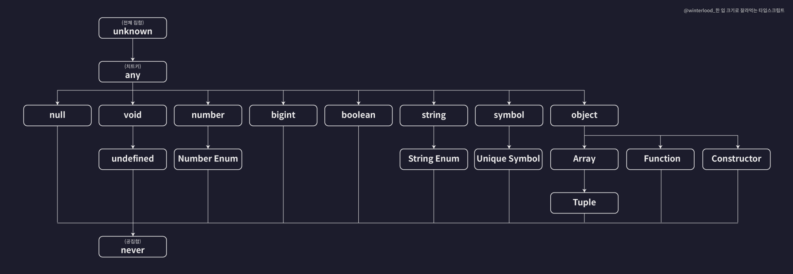

# TypeScript

- 타입스크립트란?
  - TypeScript는 JS의 구문이 허용되는, JavaScript의 *상위 집합* 언어
  - 자바스크립트에 타입(type)을 추가한 언어
  - 타입스크립트의 등장 배경
    - JavaScript는 웹 페이지에 사소한 상호작용을 추가하기 위한 작은 스크립팅 언어로 시작하여, 규모에 상관없이 프론트엔드와 백엔드 애플리케이션에서 선택 가능한 언어로 성장했다. JavaScript로 작성된 프로그램의 크기, 범위 및 복잡성은 기하급수적으로 커졌지만, 다른 코드 단위 간의 관계를 표현하는 JavaScript 언어의 능력은 그렇지 못했다.
    - 이런 JavaScript의 문제점을 극복하기 위해서 타입 시스템을 추가하여 코드의 안정성과 유지보수성을 높인 TypeScript가 등장했다.
- 기본 타입

  

  - 숫자(number)
    - 부동 소수점 값
    - 16진수, 10진수 리터럴 및 2진수, 8진수 리터럴도 지원한다.
    ```tsx
    let age: number = 25;
    let pi: number = 3.14;
    ```
  - 문자열(string)
    - 텍스트 데이터 타입
    - 큰따옴표 (`"`)나 작은따옴표 (`'`)를 문자열 데이터를 감싸는데 사용한다.
    - 백틱/백쿼트 (<code>\`</code>) 문자로 감싸지며, `${ expr }`과 같은 형태로 표현식을 포함할 수 있다.
    ```tsx
    let name: string = "John";
    let greeting: string = `Hello, ${name}`;
    ```
  - 불리언(boolean)
    - 참/거짓(true/false) 값
    ```tsx
    let isStudent: boolean = true;
    let isGraduated: boolean = false;
    ```
  - 배열(Array)
    - 동일한 타입의 요소들을 모아 놓은 데이터 구조
    ```tsx
    let list: number[] = [1, 2, 3];
    let list: Array<string> = ["Alice", "Bob", "Charlie"];
    ```
  - 튜플(tuple)
    - 요소의 타입과 개수가 고정된 배열
    - 서로 다른 타입의 요소들을 가질 수 있다.
    ```tsx
    let person: [string, number] = ["Alice", 25];
    ```
  - 열거(enum)

    - 이름이 있는 상수들의 집합을 정의한다.

    ```tsx
    enum Direction {
      Up = 1,
      Down,
      Left,
      Right,
    }

    let d: Direction = Direction.Left; // 3
    ```

    - 위 코드에서 `Up`이 `1`로 초기화된 숫자 열거형을 선언했다. 그 지점부터 뒤따르는 멤버들은 자동으로 1 증가한 값을 갖는다. 즉, `Direction.Up`은 `1`, `Down`은 `2`, `Left`는 `3`, `Right`은 `4`를 값으로 가진다.

  - Any

    - 모든 타입의 값을 가질 수 있는 타입
    - 알지 못하는 타입을 표현해야 할 때 유용하다.

    ```tsx
    let list: any[] = [1, true, "free"];

    list[1] = 100;
    ```

  - void
    - 일반적으로 함수에서 반환 값이 없음을 나타낸다.
    ```tsx
    function sayHello(): void {
      console.log("Hello");
    }
    ```
    - `void`를 타입 변수에는 `null`(`--strictNullChecks`을 사용하지 않을 때만 해당)또는 `undefined` 만 할당할 수 있다.
  - null / undefined
    - 각각 null과 undefined 값만 가질 수 있다.
    ```tsx
    let u: undefined = undefined;
    let n: null = null;
    ```
    - 기본적으로 `null`과 `undefined`는 다른 모든 타입의 하위 타입이다. 이건, null과 undefined를 `number` 같은 타입에 할당할 수 있다는 것을 의미한다. 하지만, `--strictNullChecks`를 사용하면, `null`과 `undefined`는 오직 `any`와 각자 자신들 타입에만 할당 가능하다.
  - never
    - 불가능을 의미하는 타입
    - 보통 오류를 던지거나 무한 루프에 사용된다.
    ```tsx
    function error(message: string): never {
      throw new Error(message);
    }
    ```
  - 객체(object)

    - 원시 타입이 아닌 타입
    - `number`, `string`, `boolean`, `bigint`, `symbol`, `null`, `undefined`가 아닌 나머지

    ```tsx
    let person: { name: string; age: number } = {
      name: "Alice",
      age: 25,
    };
    ```

    - 프로퍼티의 이름 뒤에 ? 를 붙여주면 해당 프로퍼티를 선택적 프로퍼티로 만들어준다.

    ```tsx
    let user: {
      id?: number; // 선택적 프로퍼티가 된 id
      name: string;
    } = {
      id: 1,
      name: "Alice",
    };

    user = {
      name: "Joy",
    };
    ```

- 인터페이스

  - 객체의 구조를 정의하기 위해 사용되는 일종의 계약
  - 객체가 가져야 할 속성들과 그 속성들의 타입을 명확하게 지정할 수 있게 해준다.
  - 인터페이스는 특정 타입에 대한 요구사항을 명시하며, 해당 요구사항을 충족하는 객체는 인터페이스를 구현(implement)한다.
  - 인터페이스 기본 사용법

    ```tsx
    interface Person {
      name: string;
      age: number;
    }

    let person: Person = {
      name: "Alice",
      age: 25,
    };
    ```

    - 인터페이스 정의
      ```tsx
      interface Person {
        name: string;
        age: number;
      }
      ```
      - `Person`이라는 인터페이스를 정의했다.
      - 이 인터페이스는 `name`과 `age`라는 두 개의 속성을 가지며, 각각 `string`과 `number` 타입이어야 한다.
    - 인터페이스 사용
      ```tsx
      let person: Person = {
        name: "Alice",
        age: 25,
      };
      ```
      - `person`이라는 객체는 `Person` 인터페이스를 따르기 때문에 `name`과 `age` 속성을 가지고, 각각 올바른 타입의 값을 가져야 한다.

  - 선택적 속성

    - 인터페이스에서 `?`를 사용하여 특정 속성을 선택적으로 만들 수 있다.

      ```tsx
      interface Person {
        name: string;
        age: number;
        email?: string; // 선택적 속성
      }

      let person1: Person = {
        name: "Bob",
        age: 30,
      };

      let person2: Person = {
        name: "Carol",
        age: 28,
        email: "carol@example.com",
      };
      ```

    - `email` 속성은 선택 사항이다. `person1`은 `email` 속성이 없고, `person2`는 `email` 속성이 있다. 둘 다 유효한 `Person` 객체이다.

  - 읽기 전용 속성

    - 인터페이스에서 특정 속성을 읽기 전용으로 지정할 수 있다. 읽기 전용 속성은 객체가 생성된 이후에 변경할 수 없다.

      ```tsx
      interface Person {
        readonly id: number;
        name: string;
        age: number;
      }

      let person: Person = {
        id: 1,
        name: "David",
        age: 22,
      };

      // person.id = 2; // 오류! 'id'는 읽기 전용 속성입니다.
      ```

    - `id` 속성은 읽기 전용이므로, 객체가 생성된 이후에 수정할 수 없다.

  - 함수 타입을 정의하는 인터페이스

    - 인터페이스는 객체의 구조뿐만 아니라 함수 타입도 정의할 수 있다.

      ```tsx
      interface MathOperation {
        (x: number, y: number): number;
      }

      let add: MathOperation = (a: number, b: number): number => {
        return a + b;
      };
      ```

    - `MathOperation` 인터페이스는 두 개의 `number` 매개변수를 받아 `number`를 반환하는 함수 타입을 정의한다.
    - `add` 함수는 `MathOperation` 타입에 맞게 정의되었다.

  - 확장

    - 인터페이스는 다른 인터페이스를 확장할 수 있다. 이를 통해 여러 인터페이스를 결합하거나, 기존 인터페이스를 기반으로 새로운 인터페이스를 만들 수 있다.

      ```tsx
      interface Person {
        name: string;
        age: number;
      }

      interface Employee extends Person {
        employeeId: number;
      }

      let employee: Employee = {
        name: "Eve",
        age: 35,
        employeeId: 1234,
      };
      ```

    - `Employee` 인터페이스는 `Person` 인터페이스를 확장하여, `name`과 `age`에 더해 `employeeId` 속성을 추가한다.

  - 인덱서블 타입

    - 인덱서블 타입 인터페이스는 객체나 배열에서 특정 키(또는 인덱스)로 값에 접근할 때 사용된다. 이때 사용할 키의 타입과 해당 키로 접근할 때 반환되는 값의 타입을 정의할 수 있다.
    - **인덱스 시그니처**는 객체의 모든 속성이 특정 타입을 가져야 한다는 규칙을 정의한다. 이때, 다른 속성의 타입이 인덱스 시그니처에서 정의한 타입과 일치하지 않으면 타입 오류가 발생한다.

      ```jsx
      interface User {
        [key: string]: string | number;
        name: string; // 문자열
        age: number; // 숫자
      }

      let user: User = {
        name: "Alice",
        age: 30,
        email: "alice@example.com",
      };
      ```

    - `User` 인터페이스에서 `[key: string]: string | number;`는 객체의 모든 속성이 `string`이나 `number` 타입을 가질 수 있다고 정의한다.
    - `name`, `age`, `email` 속성 모두 이 조건을 만족하므로 올바르게 정의된 객체이다.

  - 인터페이스와 클래스

    - 인터페이스는 클래스가 특정 구조를 따르도록 강제할 수 있다. 클래스가 인터페이스를 구현하면, 그 인터페이스에 정의된 모든 속성이나 메서드를 클래스에서 구현해야 한다.

      ```tsx
      interface Animal {
        name: string;
        makeSound(): void;
      }

      class Dog implements Animal {
        name: string;

        constructor(name: string) {
          this.name = name;
        }

        makeSound(): void {
          console.log("Woof! Woof!");
        }
      }

      let myDog = new Dog("Buddy");
      myDog.makeSound(); // "Woof! Woof!"
      ```

    - `Dog` 클래스는 `Animal` 인터페이스를 구현했다. 따라서 `Animal` 인터페이스에 정의된 `name` 속성과 `makeSound` 메서드를 반드시 포함해야 한다.

- 함수

  - TypeScript의 함수는 JavaScript의 함수에 타입을 추가한 것이다.
  - 함수 선언
    - 타입스크립트에서 함수를 선언할 때는 매개변수와 반환 값에 타입을 지정할 수 있다.
      ```tsx
      function add(x: number, y: number): number {
        return x + y;
      }
      ```
    - `x: number, y: number`: 함수의 매개변수 `x`와 `y`는 모두 `number` 타입이다.
    - `: number`: 함수가 `number` 타입의 값을 반환함을 나타낸다.
  - 함수 표현식
    - 함수를 변수에 할당하는 방식으로 표현할 수 있다. 이때도 타입을 지정할 수 있다.
      ```tsx
      const subtract = function (x: number, y: number): number {
        return x - y;
      };
      ```
    - 또는 화살표 함수로 작성할 수 있다.
      ```tsx
      const multiply = (x: number, y: number): number => {
        return x * y;
      };
      ```
  - 매개변수의 기본 값

    - 매개변수에 기본 값을 지정할 수 있다. 기본 값이 지정된 매개변수는 함수 호출 시 인자가 제공되지 않으면 기본 값이 사용된다.

      ```tsx
      function greet(name: string = "Guest"): string {
        return `Hello, ${name}!`;
      }

      console.log(greet()); // "Hello, Guest!"
      console.log(greet("Alice")); // "Hello, Alice!"
      ```

  - 선택적 매개변수

    - 특정 매개변수가 필수가 아니도록 만들려면 매개변수 이름 뒤에 `?`를 붙여 표시하면 된다.

      ```tsx
      function introduce(name: string, age?: number): string {
        if (age) {
          return `My name is ${name} and I am ${age} years old.`;
        } else {
          return `My name is ${name}.`;
        }
      }

      console.log(introduce("Alice", 25)); // "My name is Alice and I am 25 years old."
      console.log(introduce("Bob")); // "My name is Bob."
      ```

  - 나머지 매개변수

    - 나머지 매개변수를 사용해 여러 개의 인자를 배열로 받을 수 있다.

      ```tsx
      function sum(...numbers: number[]): number {
        return numbers.reduce((total, num) => total + num, 0);
      }

      console.log(sum(1, 2, 3)); // 6
      console.log(sum(10, 20, 30, 40)); // 100
      ```

  - 함수의 반환 타입
    - 함수의 반환 타입을 명시적으로 지정할 수 있지만, 만약 반환 타입을 지정하지 않으면 자동으로 추론한다. 복잡한 함수의 경우 명시적으로 반환 타입을 지정하는 것이 좋다.
      ```tsx
      function multiply(x: number, y: number) {
        return x * y;
      }
      // multiply 함수의 반환값이 number 타입임을 자동으로 추론
      ```
  - 함수 타입
    - 함수 자체를 타입으로 정의할 수 있다. 함수 타입은 함수의 매개변수 타입과 반환 타입을 명시한다.
      ```tsx
      let myFunc: (x: number, y: number) => number = function (
        a: number,
        b: number
      ): number {
        return a + b;
      };
      ```
  - 익명 함수와 콜백 함수

    - 익명 함수(함수 이름이 없는 함수)를 사용할 수 있으며, 콜백 함수로 전달할 때 주로 사용된다.

      ```tsx
      function doOperation(
        x: number,
        y: number,
        operation: (a: number, b: number) => number
      ): number {
        return operation(x, y);
      }

      console.log(doOperation(5, 3, (a, b) => a * b)); // 15
      ```

  - 오버로드

    - 같은 이름의 함수를 여러 번 정의해 다양한 매개변수 조합을 처리할 수 있게 해준다. 이를 함수 오버로드라고 한다.

      ```tsx
      function double(value: string): string;
      function double(value: number): number;
      function double(value: any): any {
        if (typeof value === "string") {
          return value + value;
        } else if (typeof value === "number") {
          return value * 2;
        }
      }

      console.log(double(10)); // 20
      console.log(double("Hi")); // "HiHi"
      ```

- 리터럴 타입
  - 하나의 값만 포함하도록 값 자체로 만들어진 타입
  ```tsx
  let strA: "hello" = "hello";
  let numA: 10 = 10;
  ```
